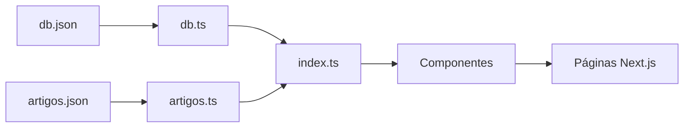
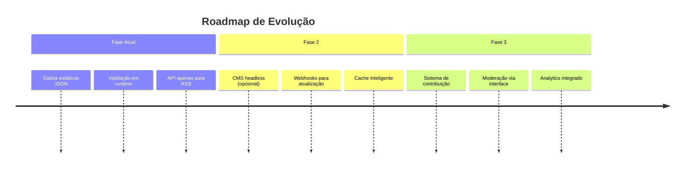

# 📚 Documentação de Arquitetura - Aristocracia

## 1. Visão Geral da Estrutura

### 1.1 Princípios da Arquitetura
- **Simplicidade**: Dados estáticos para performance máxima
- **Consistência**: Única fonte de verdade para os dados
- **Manutenibilidade**: Estrutura clara para toda a equipe
- **Performance**: Next.js com geração estática (SSG)

### 1.2 Decisão Estratégica: Por Que Sem API?
✅ **Vantagens da Abordagem Atual:**
- Carregamento instantâneo dos dados
- Zero latência de rede interna
- Simplicidade de deploy
- Custo zero em servidores
- Cache automático pelo CDN

❌ **Problemas da API Desnecessária:**
- Complexidade adicional
- Ponto único de falha
- Overhead de requisições HTTP
- Manutenção desnecessária

## 2. 📁 Estrutura do Projeto

### 2.1 Organização dos Diretórios
```
aristocracia/
├── public/data/           # 📊 Dados JSON (fonte primária)
│   ├── db.json           # Membros, porta-vozes, plataformas
│   └── artigos.json      # Artigos e conteúdo
│
├── src/lib/data/         # 🔧 Camada de acesso aos dados
│   ├── db.ts             # Serviços para db.json
│   ├── artigos.ts        # Serviços para artigos.json
│   └── index.ts          # Exportações unificadas
│
├── src/lib/types/        # 📐 Tipos TypeScript
│   └── index.ts          # Definições de tipos
│
└── src/app/              # 🎨 Páginas Next.js
    ├── (pages)           # Rotas da aplicação
    └── api/              # ❌ REMOVIDO (desnecessário)
```

### 2.2 Fluxo de Dados


## 3. 🛠️ Como Acessar os Dados

### 3.1 Importação Padrão
```typescript
// Em qualquer componente ou página:
import { 
  getMembers, 
  getFeaturedMembers,
  getMemberById,
  getPortavoze,
  getPlataformas,
  getArtigos,
  getFeaturedArtigos
} from '@/lib/data';
```

### 3.2 Exemplos Práticos

#### 3.2.1 Página de Membros
```typescript
// app/membros/page.tsx
import { getMembers, getFeaturedMembers } from '@/lib/data';

export default async function MembrosPage() {
  // Dados carregados no build - performance máxima
  const todosMembros = await getMembers();
  const destaques = await getFeaturedMembers();
  
  return (
    <div>
      <h1>Nossos Membros ({todosMembros.length})</h1>
      {/* Renderização dos dados */}
    </div>
  );
}
```

#### 3.2.2 Página Individual
```typescript
// app/membros/[id]/page.tsx
import { getMemberById, getMembers } from '@/lib/data';
import { notFound } from 'next/navigation';

export async function generateStaticParams() {
  const membros = await getMembers();
  return membros.map((membro) => ({
    id: membro.id,
  }));
}

export default async function MemberPage({ params }: { params: { id: string } }) {
  const membro = await getMemberById(params.id);
  
  if (!membro) {
    notFound();
  }
  
  return (
    <div>
      <h1>{membro.name}</h1>
      <p>{membro.bio}</p>
      {/* Resto do conteúdo */}
    </div>
  );
}
```

## 4. ✅ Sistema de Validação

### 4.1 Por Que Validar?
- Previne erros em produção
- Garante consistência dos dados
- Facilita debugging
- Melhora experiência do desenvolvedor

### 4.2 Implementação Recomendada

```typescript
// src/lib/data/validators.ts
import { Member, Portavoz, Plataforma } from '@/lib/types';

export class DataValidator {
  // Valida um membro individual
  static isValidMember(data: any): data is Member {
    return (
      typeof data?.id === 'string' &&
      typeof data?.name === 'string' &&
      typeof data?.bio === 'string' &&
      typeof data?.role === 'string' &&
      typeof data?.img === 'string' &&
      Array.isArray(data?.expertise) &&
      Array.isArray(data?.tags) &&
      typeof data?.stats === 'object'
    );
  }

  // Valida a lista completa de membros
  static validateMembers(members: any[]): Member[] {
    if (!Array.isArray(members)) {
      throw new Error('DB Validation Error: members não é um array');
    }

    const invalidMembers = members.filter(m => !this.isValidMember(m));
    
    if (invalidMembers.length > 0) {
      console.error('Membros inválidos encontrados:', invalidMembers);
      throw new Error(`DB Validation Error: ${invalidMembers.length} membros inválidos`);
    }

    return members as Member[];
  }

  // Métodos similares para portavoze, plataformas, etc.
}
```

### 4.3 Uso no db.ts Atualizado
```typescript
// src/lib/data/db.ts - VERSÃO COM VALIDAÇÃO
import { DBData } from '../types';
import dbJson from '../../../public/data/db.json';
import { DataValidator } from './validators';

export async function getDBData(): Promise<DBData> {
  try {
    // Validar cada seção
    const validatedMembers = DataValidator.validateMembers(dbJson.members || []);
    
    // TODO: Adicionar validadores para portavoze e plataformas
    
    return {
      metadata: dbJson.metadata,
      members: validatedMembers,
      portavoze: dbJson.portavoze || [],
      plataformas: dbJson.plataformas || [],
      categorias: dbJson.categorias || { temas: [], tiposConteudo: [] }
    };
  } catch (error) {
    console.error('❌ ERRO CRÍTICO na validação do db.json:', error);
    // Fallback seguro para evitar crash
    return {
      metadata: { version: 'error', lastUpdated: '', description: '', totalMembers: 0, totalArticles: 0, maintainers: [], categories: [] },
      members: [],
      portavoze: [],
      plataformas: [],
      categorias: { temas: [], tiposConteudo: [] }
    };
  }
}
```

## 5. 🔄 Sistema de Destaques (RSS Feed)

### 5.1 Arquitetura Híbrida
Para os destaques dinâmicos, criamos uma API específica:

```
src/app/api/destaques/
├── route.ts              # Endpoint principal
├── rss-fetcher.ts       # Lógica de fetch RSS
└── cache.ts            # Sistema de cache
```

### 5.2 Implementação da API de Destaques

```typescript
// src/app/api/destaques/route.ts
import { NextRequest, NextResponse } from 'next/server';
import { RSSFetcher } from './rss-fetcher';
import { CacheManager } from './cache';

// Configuração de revalidação (1 hora)
export const revalidate = 3600;

export async function GET(request: NextRequest) {
  try {
    // Verificar cache primeiro
    const cached = await CacheManager.get('destaques');
    
    if (cached && !CacheManager.isExpired(cached)) {
      return NextResponse.json(cached.data, {
        headers: { 'x-cache': 'HIT' }
      });
    }

    // Buscar novos dados
    const fetcher = new RSSFetcher();
    const destaques = await fetcher.fetchAllFeeds();
    
    // Salvar no cache
    await CacheManager.set('destaques', destaques);
    
    return NextResponse.json(destaques, {
      headers: { 'x-cache': 'MISS' }
    });
    
  } catch (error) {
    console.error('Erro na API de destaques:', error);
    
    // Fallback para dados estáticos
    const { getFeaturedArtigos } = await import('@/lib/data');
    const fallbackData = await getFeaturedArtigos();
    
    return NextResponse.json(fallbackData, {
      status: 200,
      headers: { 'x-fallback': 'true' }
    });
  }
}
```

### 5.3 Componente que Usa os Destaques

```typescript
// src/components/DestaquesFeed.tsx
'use client';

import { useEffect, useState } from 'react';
import { Artigo } from '@/lib/types';

export default function DestaquesFeed() {
  const [destaques, setDestaques] = useState<Artigo[]>([]);
  const [loading, setLoading] = useState(true);

  useEffect(() => {
    async function fetchDestaques() {
      try {
        const response = await fetch('/api/destaques');
        const data = await response.json();
        setDestaques(data);
      } catch (error) {
        console.error('Falha ao buscar destaques, usando fallback', error);
        // Fallback para dados estáticos
        const { getFeaturedArtigos } = await import('@/lib/data');
        const fallback = await getFeaturedArtigos();
        setDestaques(fallback);
      } finally {
        setLoading(false);
      }
    }

    fetchDestaques();
  }, []);

  if (loading) return <div>Carregando destaques...</div>;

  return (
    <div className="destaques-container">
      <h2>📰 Destaques do Dia</h2>
      {destaques.map((artigo) => (
        <div key={artigo.id} className="destaque-card">
          <h3>{artigo.title}</h3>
          <p>{artigo.description}</p>
          {/* Mais conteúdo */}
        </div>
      ))}
    </div>
  );
}
```

## 6. 📝 Guia de Manutenção

### 6.1 Adicionando Novo Membro
1. **Edite `public/data/db.json`**:
```json
{
  "id": "novo-membro",
  "name": "Nome Completo",
  "bio": "Descrição detalhada...",
  "role": "Nova Função",
  "img": "/persons/nova-foto.png",
  "featured": false,
  // ... outros campos obrigatórios
}
```

2. **Adicione a imagem em `public/persons/`**
3. **O sistema automaticamente:**
   - Valida a estrutura
   - Disponibiliza via `getMembers()`
   - Gera páginas estáticas no próximo build

### 6.2 Modificando Tipos
1. Ajuste `src/lib/types/index.ts`
2. Atualize os validadores em `validators.ts`
3. O TypeScript alertará sobre inconsistências

### 6.3 Comandos Úteis
```bash
# Verificar validação dos dados
npm run validate-data

# Build com verificação rigorosa
npm run build --strict

# Desenvolver com hot-reload
npm run dev
```

## 7. 🚨 Solução de Problemas

### 7.1 Erros Comuns

| **Erro** | **Causa** | **Solução** |
|----------|-----------|-------------|
| `TypeError: Cannot read property...` | JSON mal formatado | Rodar `npm run validate-data` |
| `Member not found` | ID incorreto ou ausente | Verificar `id` no db.json |
| `Invalid image path` | Caminho relativo incorreto | Usar `/persons/foto.png` |
| `Build fails` | Validação falhou | Corrigir estrutura do JSON |

### 7.2 Checklist de Validação
Antes de commitar mudanças no db.json:

- [ ] Todos os `id`s são únicos
- [ ] Caminhos de imagens começam com `/`
- [ ] `featured` é booleano (true/false)
- [ ] Arrays não estão vazios sem necessidade
- [ ] Links têm `url` e `type`
- [ ] Datas estão no formato `YYYY-MM-DD`

## 8. 📈 Próximos Passos Recomendados

### 8.1 Melhorias Imediatas
1. **Completar sistema de validação** para `portavoze` e `plataformas`
2. **Adicionar testes unitários** para os validadores
3. **Criar script de migração** para formatos futuros

### 8.2 Evolução da Arquitetura


### 8.3 Recursos Adicionais
- [Documentação Next.js](https://nextjs.org/docs)
- [TypeScript Handbook](https://www.typescriptlang.org/docs/)
- [JSON Schema Validator](https://json-schema.org/)

---

## 📞 Suporte

**Problemas com dados:**
1. Verifique a validação: `npm run validate-data`
2. Consulte `src/lib/types/index.ts` para referência
3. Confira exemplos no db.json original

**Dúvidas técnicas:** Criar issue no GitHub com tag `[arquitetura]`

**Sugestões:** Propor mudanças via Pull Request com:
- [ ] Validação atualizada
- [ ] Tipos TypeScript correspondentes
- [ ] Documentação atualizada

---

**Última atualização:** Dezembro 2025
**Versão da Arquitetura:** 2.0  
**Mantido por:** Zer0G0ld  
**Status:** ✅ Produção  

> 💡 *Esta arquitetura foi projetada para escalar organicamente. Mantenha a simplicidade enquanto atende às necessidades reais do projeto.*